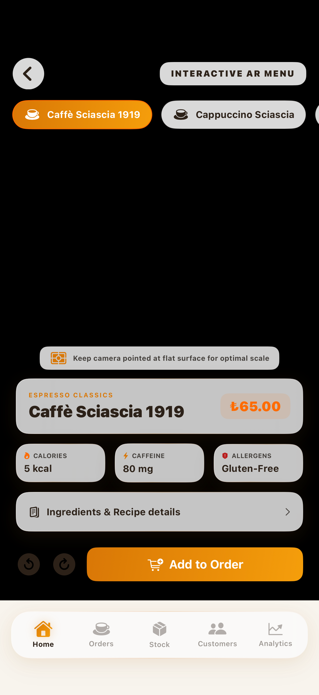
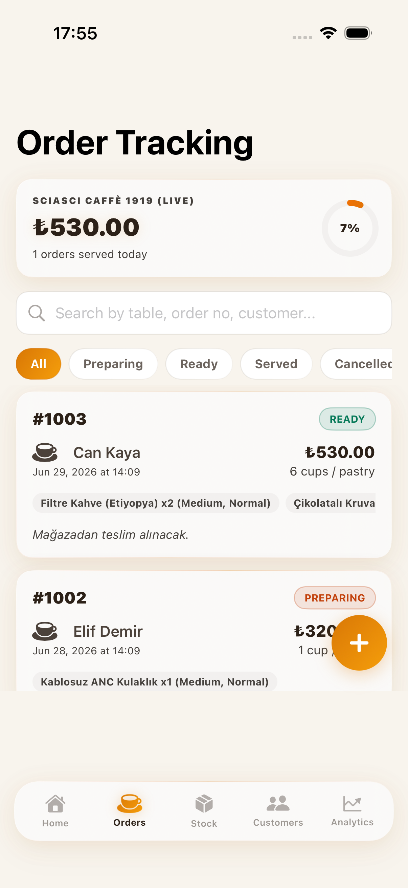
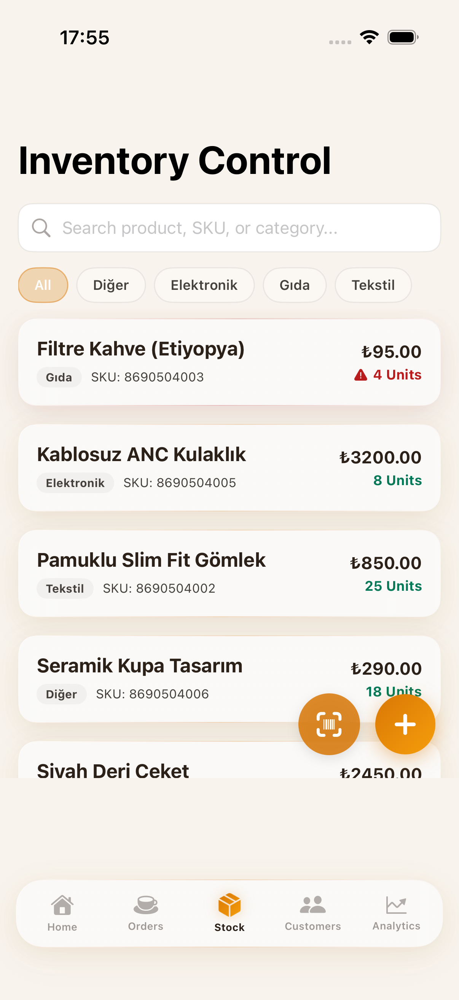
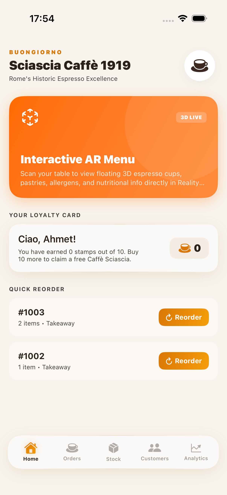

# Sciascia Caffè 1919 - Swift Mobile App

A premium iOS application built as the official digital companion for **Sciascia Caffè 1919**, one of Rome's most historic espresso bars. The app combines modern SwiftUI design with RealityKit augmented reality, SwiftData persistence, and native iOS security — all wrapped in a warm Italian cafe aesthetic.

---

## Project Overview and Purpose

The goal of this project was to translate the legacy of a 100-year-old Roman cafe into a modern mobile experience. Rather than building a generic order management tool, the app centers around user delight — starting with an interactive AR Menu where customers can inspect 3D coffee models, read ingredient and allergen information, and place orders directly from the augmented reality interface.

For cafe staff, the app provides a full suite of operational tools: live order tracking with status filters, biometric-secured inventory management, customer loyalty tracking, and a financial analytics dashboard powered by Swift Charts.

---

## App Screens and Feature Walkthrough

### Home Dashboard


The Home screen greets the user with a warm Italian tone and the *Buongiorno* header. It includes:

- **Interactive AR Menu launch card** — a prominent orange gradient card that opens the RealityKit AR experience with a single tap.
- **Loyalty Card Widget** — shows the current customer's stamp count toward a free espresso reward. Each completed order increments the counter.
- **Quick Reorder** — displays the two most recent adisyon codes with a one-tap Reorder button that duplicates the previous order, adjusts stock levels automatically, and sends the new order to the barista queue.
- **5-tab custom tab bar** at the bottom: Home, Orders, Stock, Customers, Analytics.

---

### Interactive AR Menu



The AR Menu is the centerpiece feature of the application. When launched on a physical iOS device, it uses `ARWorldTrackingConfiguration` with horizontal plane detection to anchor virtual coffee models directly onto a real table surface.

The interface includes:

- **Product Carousel** at the top — swipe between Caffè Sciascia 1919, Cappuccino Sciascia, Caffè Macchiato, Cornetto al Pistacchio, and Tiramisù Classico.
- **Floating Details Card** — displays the product category, name, and price in a glassmorphism-style card.
- **Nutritional Overlays** — three compact cards showing Calories, Caffeine content, and Allergen information for the selected item.
- **Ingredients & Recipe Details** — an expandable panel that reveals the full ingredient list and preparation description with a spring animation.
- **3D Rotation Controls** — left and right rotation buttons that spin the virtual model.
- **Add to Order** — tapping this button increments the cart counter with a spring bounce animation. Once items are added, a Checkout button appears.
- **AR Direct Checkout** — a sheet that lets the user specify a table number and customer profile, then places the order directly into the SwiftData order queue.
- On macOS and simulators, the camera feed is replaced with a **3D Simulation Mode** that renders the coffee geometry using SwiftUI 3D rotation transforms.

---

### Order Tracking



The Orders screen provides a live view of all active and past adisyon entries. Features include:

- **Live Revenue Summary** — displays today's total revenue and the number of orders served, with a circular profit margin gauge.
- **Status Filter Bar** — filter orders by All, Preparing, Ready, Served, or Cancelled using pill-shaped filter buttons.
- **Order Cards** — each card shows the order number, customer name, timestamp, total price, item summary tags, and a colored status badge.
- **Search Bar** — search by table number, order number, or customer name.
- **Swipe Actions** — swipe left on any order to mark it as Served or Cancelled.
- **New Order Button** — floating action button to open the full order creation form.

---

### Stock Inventory



The Stock screen provides baristas with full inventory management. It is protected by Face ID or Touch ID via the `LocalAuthentication` framework — unauthorized staff cannot access or modify stock data.

Features include:

- **Category filter bar** — filter by All, Food, Electronics, Textile, or custom categories.
- **Product list** — each row shows the product name, SKU, category badge, price, and current stock quantity with a warning indicator for low-stock items (shown in red).
- **Barcode Scanner** — a camera-powered barcode scanner for quick product lookup.
- **Add Product button** — opens a form to register a new SKU into the SwiftData schema.

---

### Customers



The Customers screen provides a full client directory with loyalty tracking. Features include:

- **Customer cards** — each card shows the customer name, contact information, and current loyalty stamp count.
- **Stamp Progress** — a visual indicator showing how many stamps the customer has earned toward a free drink reward.
- **Order History** — tap any customer to view their full order history and total spend.
- **Add Customer button** — quickly register a new customer profile linked to their orders and loyalty account.

---

### Analytics Dashboard


The Analytics screen provides a financial overview of cafe performance using Swift Charts. It includes:

- **Revenue Summary Cards** — total gross revenue, operational cost, and net profit figures.
- **Net Margin Gauge** — a circular progress indicator visualizing the profit margin percentage.
- **Category Sales Distribution** — a bar chart breaking down revenue by product category.
- **Daily / Weekly Trend Line** — a line chart showing order volume and revenue trends over time.

---

## Technical Stack

| Layer | Technology |
|---|---|
| User Interface | SwiftUI with spring animations, matched geometry, confetti effects |
| Augmented Reality | RealityKit + ARKit (horizontal plane detection, 3D anchors) |
| Database | SwiftData (offline-first, local persistence) |
| Security | LocalAuthentication (Face ID / Touch ID) |
| Charts | Swift Charts |
| Shortcuts | AppIntents + Siri integration |
| Tips | TipKit inline barista guidance |
| Widgets | WidgetKit + Live Activities |

---

## Architecture and Design Decisions

The application uses an **offline-first architecture** backed by SwiftData. All orders, products, and customer records are persisted locally and can be created, modified, and queried without a network connection — critical for busy cafe environments.

### Color System (High-Contrast Warm Theme)

| Token | Value | Usage |
|---|---|---|
| Background | `#F8F4ED` Warm Cream | All screen backgrounds |
| Primary Text | `#2C2118` Deep Brown | Headings, order numbers |
| Secondary Text | `#44403C` Dark Gray | Body copy, timestamps |
| Brand Orange | `#FF6B00` | Buttons, highlights, gradients |
| Golden | `#D97706` | Loyalty stamps, category labels |
| Status Green | Ready badge | Order ready state |
| Status Amber | Preparing badge | Order in progress |

---

## Platform Compatibility

- **iOS 17.0+**: Full camera stream, AR plane tracking, biometric auth, haptic feedback.
- **macOS 14.0+**: 3D Simulation Mode replaces the camera view. Biometric fallback uses passcode simulation.

---

## How to Run

1. Open `followorder.xcodeproj` in Xcode 15 or later.
2. Set the active scheme to `followorder`.
3. Select an iOS Simulator (iPhone 15 Pro or later recommended) or connect a physical device.
4. Press `Cmd + R` to build and run.

To run unit tests only (bypasses the Gatekeeper-flagged UI runner):
```bash
xcodebuild -project followorder.xcodeproj -scheme followorder \
  -destination 'platform=macOS' \
  CODE_SIGN_IDENTITY="" CODE_SIGNING_REQUIRED=NO \
  -only-testing:followorderTests test
```
